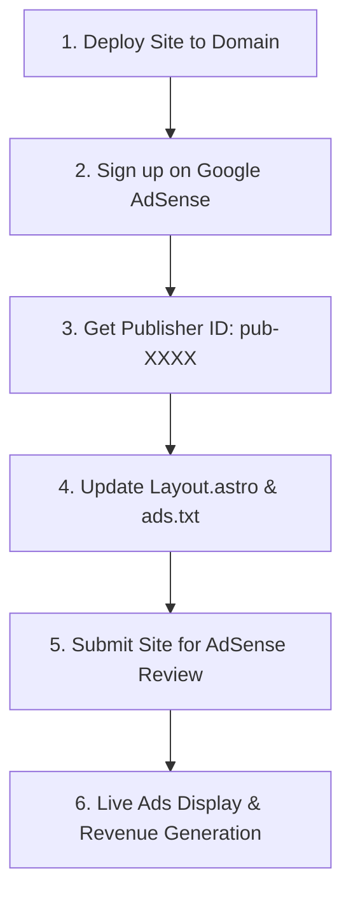

# 📌 Complete Step-by-Step Google AdSense Integration & Monetization Guide

This guide explains **exactly what you need to provide**, how to get approved, and how to connect your live Google AdSense ads to this platform.

---

## 1. What You Need to Bring / Provide

You **do not** just paste a simple link. Google AdSense operates through a **Publisher Account** and gives you a unique **Publisher ID**.

Here is what you need:
1. **A Custom Domain Name**: (e.g., `www.yourtaxcalc.com`). Google AdSense does not typically approve free subdomains (like `.pages.dev` or `.vercel.app` on initial application).
2. **A Google AdSense Account**: Signed up using your Google/Gmail account at [https://adsense.google.com](https://adsense.google.com).
3. **Your Unique Publisher ID (`pub-XXXXXXXXXXXXXXXX`)**: A 16-digit numeric ID located in your AdSense dashboard under **Account > Settings > Account Information**.

---

## 2. Step-by-Step Setup Process



### Step 1: Deploy Your Website
Deploy your Astro 5 build to your hosting provider (e.g., **Cloudflare Pages**, **Vercel**, or **Netlify**) and link your custom domain.

### Step 2: Add Your Site to Google AdSense
1. Log in to [Google AdSense Console](https://adsense.google.com).
2. Click **Sites** in the left menu.
3. Click **Add site** and enter your domain name (e.g., `yourtaxcalc.com`).

---

### Step 3: Put Your Publisher ID in the Codebase

You only need to update **2 files** in this codebase:

#### File A: `src/layouts/Layout.astro`
Open [`src/layouts/Layout.astro`](file:///home/yohannes/Desktop/untitled%20folder/src/layouts/Layout.astro#L19-L21) and replace `ca-pub-0000000000000000` with your actual Publisher ID:

```astro
// src/layouts/Layout.astro (Line 19)
const adSenseClientId = 'ca-pub-1234567890123456'; // <-- Replace with your real Pub ID
```

This automatically injects the Google AdSense loader script across every single page:
```html
<script
  async
  src="https://pagead2.googlesyndication.com/pagead/js/adsbygoogle.js?client=ca-pub-1234567890123456"
  crossorigin="anonymous"
></script>
```

#### File B: `public/ads.txt`
Open [`public/ads.txt`](file:///home/yohannes/Desktop/untitled%20folder/public/ads.txt) and replace the placeholder with your Publisher ID:

```text
google.com, pub-1234567890123456, DIRECT, f08c47fec0942fa0
```
*(When deployed, this file will be automatically accessible at `https://yourdomain.com/ads.txt`, fulfilling Google's anti-fraud seller verification requirement).*

---

### Step 4: Choose How Ads Appear

Google AdSense gives you two ways to display ads:

#### Option 1: Auto Ads (Recommended for Beginners & High Yield)
1. In your AdSense dashboard, go to **Ads > By site**.
2. Click the edit (pencil) icon next to your domain.
3. Turn ON **Auto ads**.
4. Enable **Anchor ads** (mobile sticky bottom banner) and **Side rail ads** (desktop side sticky units).
5. Click **Apply to site**. Google AI will automatically optimize and render high-paying ads across the site.

#### Option 2: Custom Ad Units (For Exact Layout Control)
If you want to manually configure each banner:
1. Go to **Ads > By ad unit**.
2. Create responsive **Display ad units** (e.g., Top Leaderboard, Sidebar Rectangle).
3. Copy the generated `data-ad-slot` number (e.g., `8947291048`).
4. In [`src/components/AdUnit.tsx`](file:///home/yohannes/Desktop/untitled%20folder/src/components/AdUnit.tsx), paste your `data-ad-slot` into the corresponding slot container.

---

### Step 5: Request Review & Get Approved
In your AdSense Dashboard:
1. Check the box **"I've placed the code"** or **"I updated ads.txt"**.
2. Click **Request review**.
3. AdSense review typically takes between **24 hours to 14 days**.

---

## 3. Why This Platform is Pre-Optimized for Immediate AdSense Approval

1. **Valuable Inventory Policy Compliant**: Contains in-depth statutory tax explanations, formula mechanics, and FAQs on every page (Google rejects calculator sites with thin/empty content).
2. **Zero-CLS Bounding Boxes**: Ad slots have fixed CSS min-heights (`ad-slot-leaderboard`, `ad-slot-sidebar`) to prevent layout shifts and pass Google Core Web Vitals.
3. **IAB-Compliant CMP Banner**: Includes a cookie consent banner (`CookieConsent.tsx`) supporting GDPR, UK-GDPR, and CCPA requirements.
4. **Mandatory Legal Pages Included**: Pre-built `/privacy-policy`, `/terms-of-service`, `/disclaimer`, and `/contact` pages.
